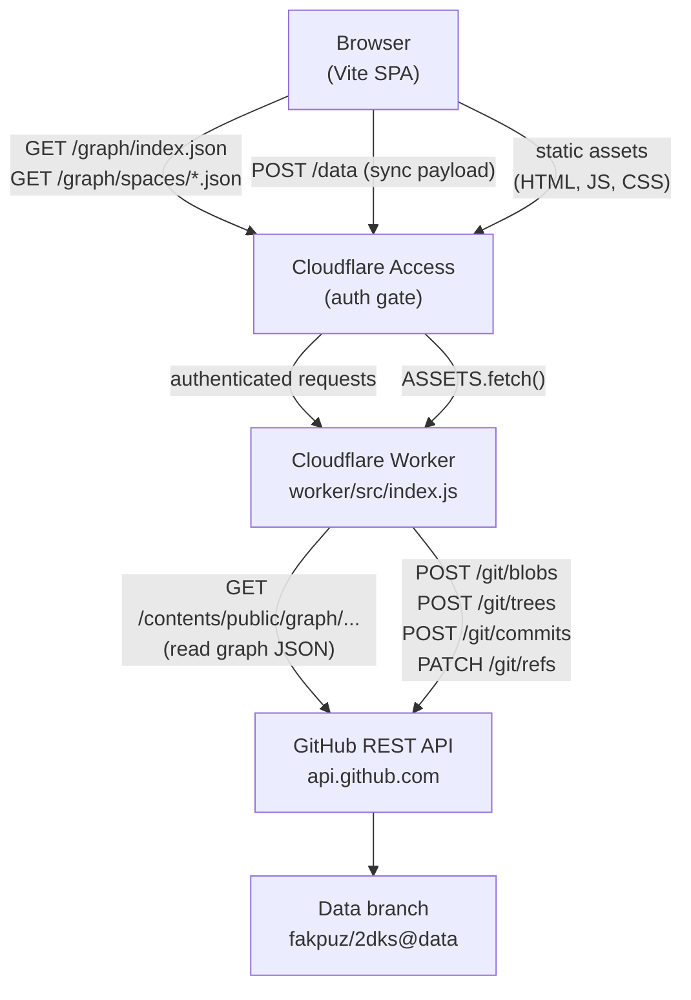
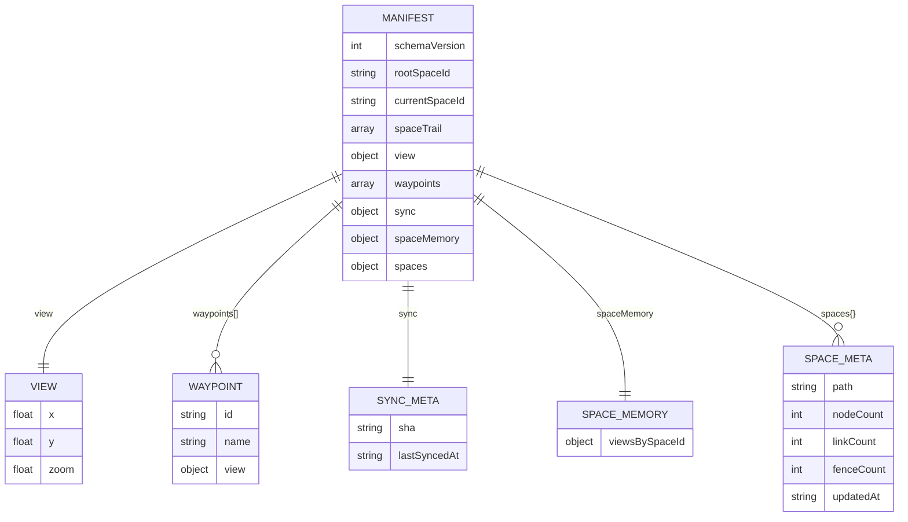
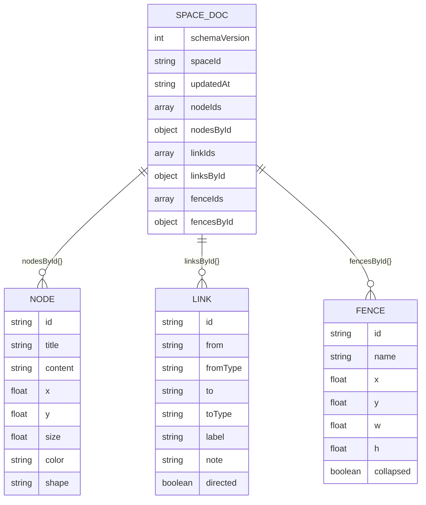
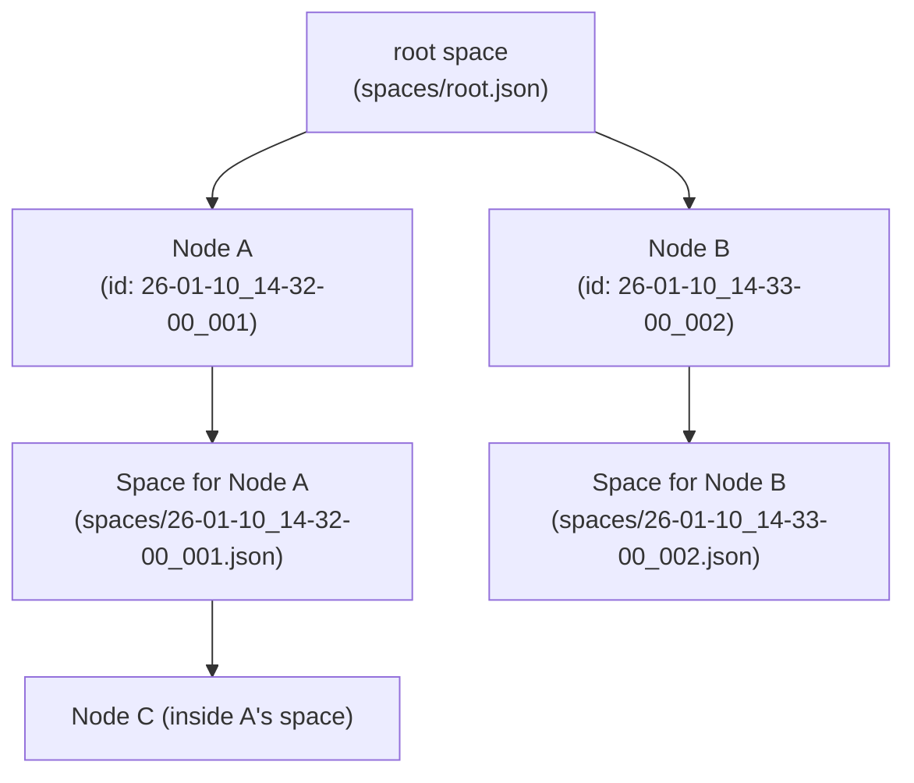
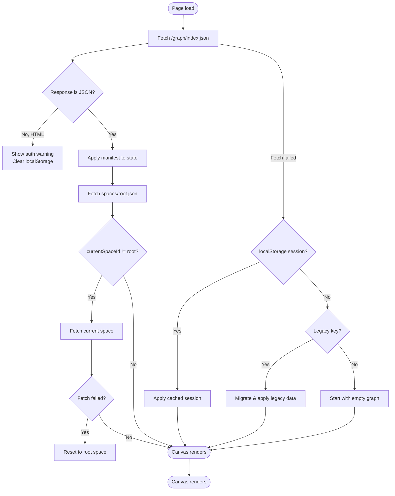

# Architecture

This document describes how the system components fit together, how data flows between them, and what each piece is responsible for.

---

## System Overview



The browser never talks to GitHub directly. All GitHub access goes through the Worker, which holds the `GITHUB_TOKEN` as a secret that is never exposed to the client.

---

## Component Responsibilities

### Browser (Vite SPA)

Built with Vite 8. Single `index.html` shell; all logic in `src/js/`. No framework — pure DOM APIs and Canvas 2D.

The SPA is responsible for:
- Rendering the canvas (nodes, links, fences, grid, minimap)
- Handling all user input (mouse, keyboard)
- Managing in-memory application state (`state.js`)
- Serializing/deserializing graph data (`repo-data.js`)
- Reading graph data from the Worker on boot (`/graph/...`)
- Writing graph data to the Worker on sync (`POST /data`)
- Local persistence in `localStorage` as an offline cache and dirty-change buffer

### Cloudflare Worker

A single JavaScript module at `worker/src/index.js`. Runs on Cloudflare's edge network, co-located with the static asset bundle.

The Worker is responsible for:
- Serving graph JSON reads from the `data` branch of the GitHub repo
- Writing sync commits back to the `data` branch using the low-level Git Data API
- Proxying all other requests to the static asset bundle

The Worker does **not** do authentication. That is handled by Cloudflare Access, which is configured at the zone/route level in the Cloudflare dashboard.

### Cloudflare Access

Sits in front of the Worker's domain. Intercepts every request and requires the visitor to authenticate (via a configured identity provider, e.g. email OTP, Google, GitHub). Issues a signed JWT cookie on success. Unauthenticated requests get a login redirect page.

The SPA detects a CF Access redirect by checking whether the response to `/graph/index.json` contains HTML instead of JSON, and surfaces a human-readable warning.

### GitHub REST API

Used for two operations:

**Read** — `GET /repos/:owner/:repo/contents/:path?ref=:branch` returns a base64-encoded file from the `data` branch.

**Write** — A multi-step Git Data API sequence:
1. `GET /git/ref/heads/:branch` — get the current HEAD commit SHA
2. `GET /git/commits/:sha` — get the base tree SHA
3. `GET /git/trees/:sha?recursive=1` — list all tracked file paths (to identify deletions)
4. `POST /git/blobs` (once per changed file) — upload new file content
5. `POST /git/trees` — create a new tree combining the base tree with the new blobs
6. `POST /git/commits` — create a new commit
7. `PATCH /git/refs/heads/:branch` — advance the branch pointer

### Data Branch (`fakpuz/2dks@data`)

An orphan branch of the app repo that shares no history with `main`. Contains only:

```
public/graph/
├── index.json
└── spaces/
    ├── root.json
    └── <spaceId>.json
```

No code. No CI. Just JSON files and a git history of every sync event, kept separate from the code history on `main`.

---

## Data Model Diagrams

### index.json Structure



### Space Document Structure



### Space Hierarchy

Spaces are identified by node IDs. When a node with ID `abc` is double-clicked, the app enters a space also named `abc`. This means the space hierarchy mirrors the node graph.



---

## Frontend Module Graph

```mermaid
graph TD
    main["main.js\nEntry point"]
    state["state.js\nIn-memory state"]
    graph["graph.js\nGraph mutations\nLayout algorithms"]
    render["render.js\nCanvas paint loop"]
    input["input.js\nEvent handlers"]
    ui["ui.js\nDOM panels, HUD"]
    storage["storage.js\nLoad/save/sync"]
    repodata["repo-data.js\nSchema, serialize\nSearch index"]
    spacememory["space-memory.js\nPan/zoom memory"]
    markdown["markdown.js\nMarkdown renderer"]

    main --> state
    main --> graph
    main --> storage
    main --> render
    main --> input
    main --> ui

    input --> graph
    input --> state
    input --> render
    input --> storage
    input --> ui
    input --> spacememory

    ui --> graph
    ui --> state
    ui --> storage
    ui --> spacememory

    storage --> repodata
    storage --> spacememory
    storage --> state
    storage --> ui

    graph --> repodata
    graph --> state

    render --> graph
    render --> state
    render --> markdown

    repodata --> spacememory
```

---

## Sync Flow

```mermaid
sequenceDiagram
    participant User
    participant Browser
    participant Worker
    participant GitHub

    User->>Browser: Press S
    Browser->>Browser: syncPayload() — serialize dirty spaces
    Browser->>Worker: POST /data {manifest, spaces}
    Worker->>GitHub: GET /git/ref/heads/data
    GitHub-->>Worker: {sha: "abc123..."}
    Worker->>GitHub: GET /git/commits/abc123
    GitHub-->>Worker: {tree: {sha: "tree456..."}}
    Worker->>GitHub: GET /git/trees/tree456?recursive=1
    GitHub-->>Worker: [all file paths]
    loop For each changed file
        Worker->>GitHub: POST /git/blobs {content}
        GitHub-->>Worker: {sha: "blob789..."}
    end
    Worker->>GitHub: POST /git/trees {base_tree, entries}
    GitHub-->>Worker: {sha: "newtree..."}
    Worker->>GitHub: POST /git/commits {message, tree, parents}
    GitHub-->>Worker: {sha: "newcommit..."}
    Worker->>GitHub: PATCH /git/refs/heads/data {sha: "newcommit..."}
    GitHub-->>Worker: 200 OK
    Worker-->>Browser: {success: true, sha: "newcommit..."}
    Browser->>Browser: clearDirtyState(); persistLocalSession()
    Browser->>User: Toast: "Synced SHA: abc1234"
```

---

## Boot Sequence



---

## Local Persistence

The app persists a local session to `localStorage` on every change. This serves two purposes:

1. **Offline resilience** — if the Worker fetch fails, the app falls back to the cached session and the user can keep working.
2. **Dirty-change buffer** — `dirtySpaces` is persisted so that unsync'd changes survive a page close and can be pushed on next open.

The `localStorage` key is `2dks-session-v4`. The stored object includes the manifest, all loaded space data, dirty tracking, and UI preferences (tag filter, pinned panel, editor split). UI preferences are not committed to GitHub.

---

## What Is Not in the Architecture

- **No database** — data is flat JSON in GitHub.
- **No server-side rendering** — everything is client-side.
- **No WebSockets or real-time channel** — sync is pull-on-load plus manual push.
- **No authentication logic in the Worker** — CF Access handles this at the edge before requests reach the Worker.
- **No CDN cache for graph files** — graph responses are served with `Cache-Control: no-store, private` because they must always be fresh.
